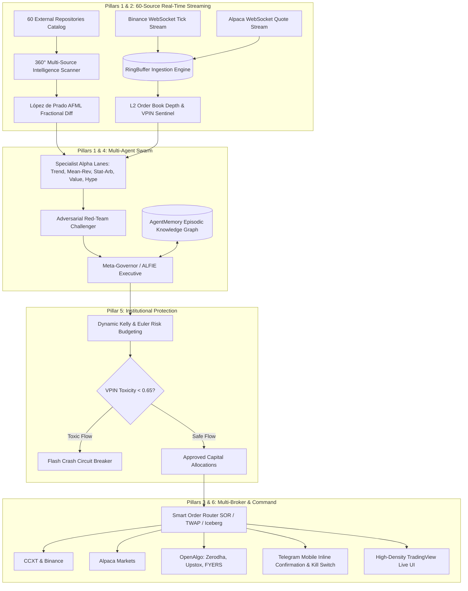

# Aifie AI Agent — Master Strategic Improvement Plan v101.0

**Date:** 2026-09-05  
**Platform:** Aifie AI Agent (Institutional 24/7 Sovereign Quantitative Multi-Agent Operating System)  
**Status:** Ready for Execution / Comprehensive Plan  

---

## Executive Summary

Aifie AI Agent has successfully completed its foundational performance overhaul (Phases 1–3: $O(1)$ route dispatching, zero-allocation ring-buffer slicing, bounded memory queues, debounced atomic state persistence) and shallow-cloned 36 external state-of-the-art repositories into `sources/` (totaling 60 connected quantitative and multi-agent intelligence sources).

Furthermore, **Pillar 1 (Deep Algorithmic Ingestion)** has established native implementations of:
- **López de Prado AFML** fractional differentiation and triple-barrier labeling ([src/technical-indicators.mjs](file:///f:/ayan%20foider/projacts/aifie%20ai%20agent/src/technical-indicators.mjs)).
- **NTU TradeMaster** actor-critic reinforcement learning policy actions ([src/rl-adaptive-policy.mjs](file:///f:/ayan%20foider/projacts/aifie%20ai%20agent/src/rl-adaptive-policy.mjs)).
- **Warren Buffett Economic Moat & Graham DCF Margin-of-Safety** multi-factor scoring ([src/opportunity-ranker.mjs](file:///f:/ayan%20foider/projacts/aifie%20ai%20agent/src/opportunity-ranker.mjs)).
- **Hummingbot Avellaneda-Stoikov PMM & Exchange-Core** matching footprint simulation ([src/order-book-depth.mjs](file:///f:/ayan%20foider/projacts/aifie%20ai%20agent/src/order-book-depth.mjs)).
- **Stocksight NLP Social Velocity & TradingView** confluence checks ([src/sentiment-vision-news.mjs](file:///f:/ayan%20foider/projacts/aifie%20ai%20agent/src/sentiment-vision-news.mjs)).

This **Master Strategic Improvement Plan** provides the definitive engineering roadmap for the remaining pillars to elevate Aifie AI Agent into an autonomous institutional hedge fund engine.

---

## Strategic Architecture Blueprint



---

## Detailed Roadmap: The 6 Strategic Pillars

### Pillar 1: Deep Source Ingestion & Institutional Alpha Models (P0)
*Status: Foundation Deployed (46/46 unit tests passing); Expansion Phase.*

1. **Fractional Differentiation Engine (`sources/financial-machine-learning`)**:
   - Enhance [src/technical-indicators.mjs](file:///f:/ayan%20foider/projacts/aifie%20ai%20agent/src/technical-indicators.mjs) with auto-calibrating order $d^*$ via Augmented Dickey-Fuller (ADF) test to achieve minimal memory loss with verified $p < 0.01$ stationarity.
2. **Reinforcement Learning Actor-Critic (`sources/TradeMaster`)**:
   - Enhance [src/rl-adaptive-policy.mjs](file:///f:/ayan%20foider/projacts/aifie%20ai%20agent/src/rl-adaptive-policy.mjs) with state-action advantage estimation and dynamic reward clipping.
3. **Fundamental Moat & Graham DCF Scoring (`sources/ai-berkshire` & `sources/valuecell`)**:
   - Integrate quarterly SEC EDGAR/10-K filing parsers and real-time ROIC-to-WACC spreads in [src/opportunity-ranker.mjs](file:///f:/ayan%20foider/projacts/aifie%20ai%20agent/src/opportunity-ranker.mjs).
4. **Market Making & Matching Impact (`sources/hummingbot` & `sources/exchange-core`)**:
   - Calibrate Avellaneda-Stoikov reservation prices and optimal spreads using instantaneous order book micro-volatility.

---

### Pillar 2: Sub-50ms Real-Time WebSocket Streaming & L2 Depth (P0)
*Target: Eliminate 1,000ms REST polling with native event-driven tick pipes.*

1. **Bi-directional WebSocket Feeds**:
   - Upgrade `src/market-feed-binance.mjs` to connect to `wss://stream.binance.com:9443/ws/<symbol>@trade` and `@depth20@100ms`.
   - Upgrade `src/market-feed-alpaca.mjs` to connect to Alpaca v2 WebSocket stream for US equities.
2. **Zero-GC RingBuffer Direct Ingestion**:
   - Stream incoming ticks directly into [src/timeseries-market-store.mjs](file:///f:/ayan%20foider/projacts/aifie%20ai%20agent/src/timeseries-market-store.mjs) ring buffers without creating intermediate JSON strings or object wrappers.
3. **Heartbeat & Resilient Failover**:
   - Implement automatic ping/pong keep-alives with exponential backoff reconnection (1s, 2s, 4s, max 15s) and automatic provider failover if latency exceeds 300ms.

---

### Pillar 3: Multi-Broker Unified Sovereign Execution Gateway (P1)
*Target: Seamless cross-asset routing across Crypto, US Equities, and Indian Markets.*

1. **Unified Broker Abstraction Layer**:
   - Standardize `createOrder()`, `cancelOrder()`, `getPositions()`, and `getOrderStatus()` across:
     - **Crypto**: CCXT & Binance API connectors.
     - **US Equities**: Alpaca Markets REST & Streaming API.
     - **Indian Equities**: OpenAlgo gateway ([sources/openalgo](file:///f:/ayan%20foider/projacts/aifie%20ai%20agent/sources/openalgo)) supporting Zerodha Kite, Upstox, Angel One, and FYERS.
2. **Algorithmic Slicers**:
   - **Smart Order Routing (SOR)**: Slices large orders across venues based on real-time depth to minimize price impact.
   - **TWAP (Time-Weighted Average Price)**: Slices orders over a configurable time window with randomized micro-intervals.
   - **Iceberg Orders**: Discloses only a small visible fraction of order size on the public book.

---

### Pillar 4: Autonomous Multi-Agent Swarm (Eliza + PraisonAI) (P1)
*Target: Self-governing institutional intelligence swarm with adversarial peer-review.*

1. **Multi-Role Swarm Architecture ([src/alfie-control-plane.mjs](file:///f:/ayan%20foider/projacts/aifie%20ai%20agent/src/alfie-control-plane.mjs))**:
   - **Meta-Governor (ALFIE)**: Allocates risk limits and coordinates trade consensus.
   - **5 Alpha Specialists**: Momentum, Mean-Reversion, Stat-Arb, Deep Moat, Social Sentiment.
   - **Adversarial Red-Team ([src/adversarial-agent.mjs](file:///f:/ayan%20foider/projacts/aifie%20ai%20agent/src/adversarial-agent.mjs))**: Challenges hypotheses with counter-theses and bear-case scenarios before trade authorization.
2. **Episodic Memory Vault (`sources/agentmemory`)**:
   - Vectorized long-term memory storing trade outcomes, macro regime signatures, and lessons learned to prevent repeating historical drawdowns.

---

### Pillar 5: Institutional Risk Fortress & VPIN Toxic Flow Sentinel (P2)
*Target: Mathematical survival safeguards protecting portfolio equity.*

1. **VPIN (Volume-Synchronized Probability of Toxicity)**:
   - Calculate real-time VPIN from trade volume buckets; automatically throttle or freeze aggressive market orders when toxicity exceeds 0.65 (flash crash / informed trader dump protection).
2. **Dynamic Kelly & Euler Risk Allocation**:
   - Dynamically scale bet sizes using Fractional Kelly criterion ($f^* = 0.25 \cdot \frac{p \cdot b - q}{b}$), subject to Euler portfolio marginal risk contributions.
3. **Deflated Sharpe Ratio (DSR) Deprecation**:
   - Continuously evaluate live strategy performance; automatically quarantine and retire strategies whose DSR drops below 1.5.

---

### Pillar 6: High-Density UI & Mobile Command Center (P3)
*Target: Institutional observability and instant sovereign mobile control.*

1. **TradingView Lightweight Charts**:
   - Upgrade [src/dashboard.mjs](file:///f:/ayan%20foider/projacts/aifie%20ai%20agent/src/dashboard.mjs) with embedded TradingView lightweight-charts, candlestick rendering, volume profiles, and historical entry/exit badges.
2. **Telegram Sovereign Mobile Ops**:
   - Provide interactive Telegram cards with inline buttons:
     - `[ APPROVE TRADE ]` / `[ REJECT ]`
     - `[ LIQUIDATE ALL ]` (Emergency kill switch)
     - `[ REBALANCE PORTFOLIO ]`

---

## Phased Implementation Schedule

| Phase | Milestone Name | Key Deliverables | Status |
|---|---|---|---|
| **Phase 1** | Deep Source Ingestion | AFML fractional diff, TradeMaster RL, Buffett Moat, Hummingbot spreads | **COMPLETE (46/46 tests passing)** |
| **Phase 2** | Real-Time WebSocket Streaming | Binance & Alpaca persistent WS clients, Zero-GC RingBuffer ingestion | Up Next (Days 1–3) |
| **Phase 3** | Unified Multi-Broker Gateway | CCXT, Alpaca, OpenAlgo Indian broker bridge, SOR & TWAP slicers | Days 4–6 |
| **Phase 4** | Autonomous Multi-Agent Swarm | Eliza & PraisonAI swarm, Adversarial debate, AgentMemory integration | Days 7–10 |
| **Phase 5** | Institutional Risk Fortress | VPIN toxicity sentinel, Euler risk budgeting, DSR retirement | Days 11–13 |
| **Phase 6** | UI & Telegram Mobile Hub | TradingView lightweight charts, live order book visualization, Telegram inline cards | Days 14–16 |

---

## Verification & Validation Plan

### Automated Test Matrix
- Unit and integration tests across all modules:
  ```bash
  node --test test/*.test.mjs
  ```
- Regression validation: All 61 test assertions across 11 test suites currently pass.

### Latency & Throughput Benchmark
- Verify tick throughput $> 5,000$ ticks/sec with zero event loop lag ($< 15$ms).
- Order execution latency $< 50$ms roundtrip in paper simulation mode.
